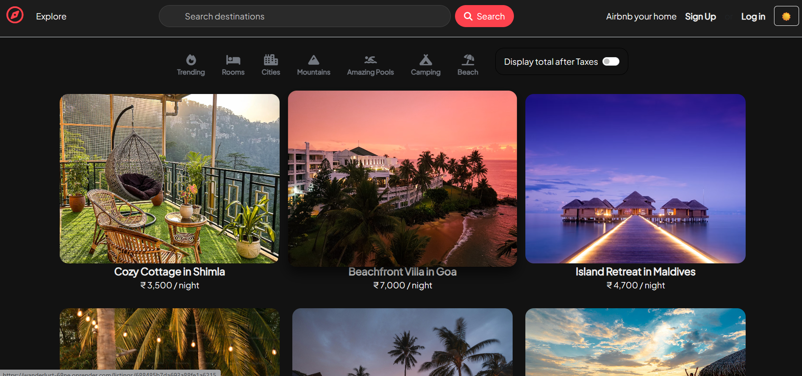
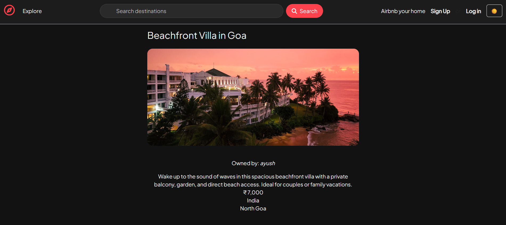
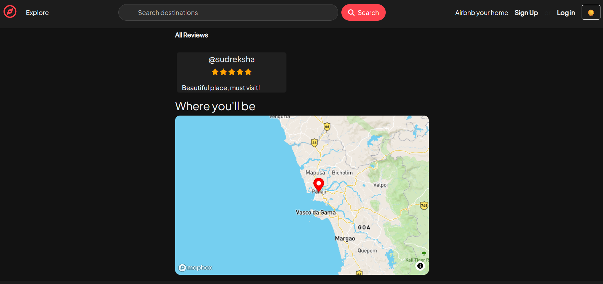
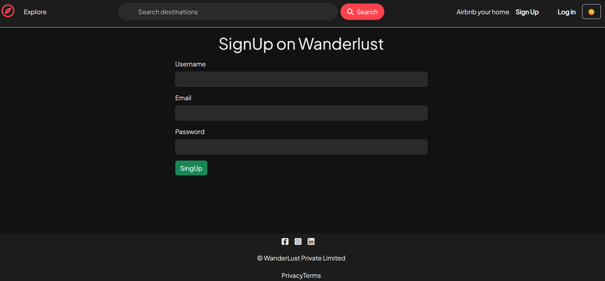

## Wanderlust

## Introduction
Wanderlust is a full-stack web application built to simulate a real-world accommodation listing platform. 
It allows users to create, explore, and manage location-based listings with secure authentication, 
role-based authorization, user reviews, and interactive map integration.

The project focuses on backend structure, access control, and scalable CRUD design rather than UI-heavy features.

## 🚀 Live Demo

Live: https://wanderlust-68ne.onrender.com/listings

## 🧩 Key Features
🔐 Authentication & Authorization

- User signup and login using Passport.js
- Session-based authentication
- Role-based authorization:
- Only listing owners can edit/delete listings
- Only review authors can delete their reviews

## 🏠 Listings Management

- Create, edit, view, and delete listings
- Image upload using Cloudinary
- Category-based filtering
- Responsive UI using Bootstrap

## ⭐ Reviews System

- Add reviews to listings
- Rating support
- Author-based review deletion

## 🗺️ Map Integration

- Interactive maps using Mapbox
- Location-based visualization of listings
- Graceful fallback for missing geolocation data

## ⚙️ Backend Engineering Highlights

- MVC architecture
- Centralized error handling using custom ExpressError
- Async error wrapper (wrapAsync)
- Input validation using Joi
- Flash messages for user feedback

## 🧠 Design Decisions

- Used session-based authentication with Passport.js to simplify server-side access control.
- Followed MVC architecture to keep routing, business logic, and data models cleanly separated.
- Implemented centralized error handling to avoid repetitive try-catch blocks.
- Ownership-based authorization ensures users can only modify their own data.


## 🛠️ Tech Stack
Frontend:

- HTML5
- CSS3
- JavaScript
- Bootstrap
- EJS (templating)

Backend:

- Node.js
- Express.js
- MongoDB
- Mongoose
- Passport.js

Integrations & Tools:

- Cloudinary (image hosting)
- Mapbox (maps & geocoding)
- MongoDB Atlas
- Express-session & connect-mongo

## 📁 Project Structure

```bash
/models        → Mongoose schemas
/routes        → Express routes
/controllers   → Business logic
/views         → EJS templates
/public        → Static assets
/utils         → Error handling utilities
```

## 🔒 Security & Validation
- Joi-based server-side validation
- Protected routes with authentication middleware
- Ownership-based access control

## 🧪 Current Scope vs Future Enhancements
✅ Implemented

- User authentication & authorization
- Listings & reviews CRUD
- Map-based listing visualization
- Image upload & storage

🔜 Planned Enhancements

- Booking & availability system
- Date-based price calculation
- Pagination & performance optimizations
- Soft delete for listings
- REST API versioning

## 🏗️ Installation & Setup

```bash
git clone https://github.com/snehaprajapati25/Wanderlust.git
cd wanderlust
npm install
npm start
```

## 📸 Screenshots

### Listings & Exploration


### Listing Details


### Reviews & Location Map


### User Authentication


